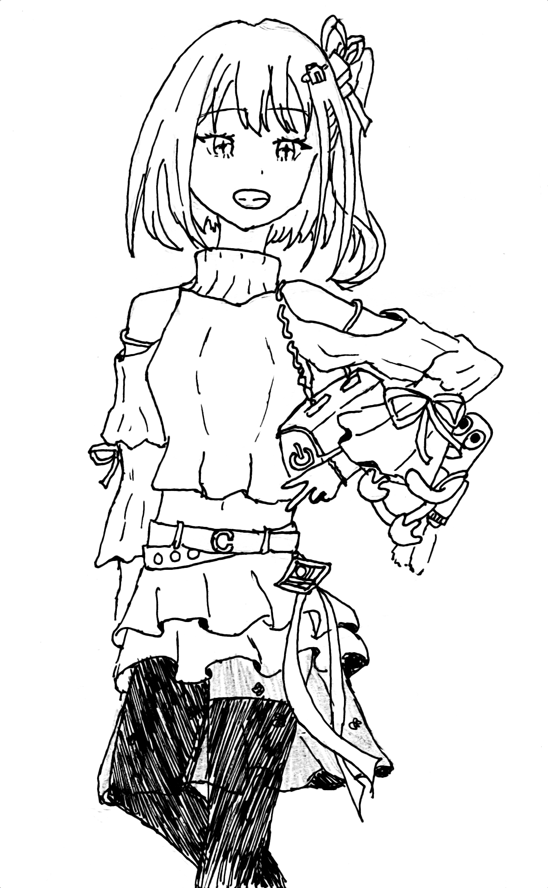

<!--
 * @Author: Guo Yaoze, Qu Zhixuan, Sun Longyu, Pu Zhengyu, Zhang Yuntao, Peng Huanran, Yang Qihao
 * @License: AGPLv3
 * @Date: 2023-10-19 20:37:06
 * @LastEditTime: 2023-10-22 20:49:29
 * @Description: README
 * @FilePath: /MikuMikuLive/README.md
-->
# MikuMikuLive

持续施工中……

## 计划实现的Features

1. "LDF", Live Description File, 演出描述文件, "描述"您的演出.
2. 简单的配置即可运行, 甚至无需配置, 故无需担心配置环境是麻烦的.
3. 跨平台. 不管您是Windows还是Linux, 不管您是amd64还是ARM, 我们都为您准备了官方构建的二进制文件.
4. 一个简单但是实用的控制器, 且TUI. 这意味着您不需要使用鼠标, 只用键盘就好了, 对于某些不方便使用鼠标的环境, 比如在控制台比较狭小且没有鼠标垫的时候, 会比较有用, 且相比鼠标操作, 用键盘显然可以更快.
5. 一套非常易于使用的API. 前端可以自行定制而不需要碰这堆可能对您来说很不熟悉的Golang代码. (正在开发)
6. 一个易于理解的Makefile, 您可以轻松构建这个应用程序. 如果没有您需要的系统/架构组合, 只需要稍微复制更改即可.

## 使用说明

也许你会问, 如何写LDF? 您可以查看ldf.d/demo.ldf来学习.

## 当前版本

版本: 0.1-alpha.  
版本代号: Miku.  
许可证: AGPLv3.  
Coded&Built on Arch Linux (6.5.8-zen1-1-zen)  
Tested on Arch Linux (6.5.8-zen1-1-zen) & Windows 10 (VM)  

## 吉祥物

高清大图附在最后面.
以下是一点点简单的描述:  
也许与Tux在某些地方有些类似, 她:

1. 爽翻了, 堪比刚刚喝下去一扎鲜啤酒, 然后又参加了一个无与伦比的大派对.
2. 是非常独特的, 我想在这个项目出现之前她从来没有被画出来过.
3. 表情绝对不会是悲伤的, 我们不希望程序出BUG, 因为这关系到节目效果.
4. 绝对是个可爱的女孩子.

她暂时还没有名字, 欢迎大家取名.
她是Pu Zhengyu创作的.

## 开发团队

Guo Yaoze(<functionsir@outlook.com>)  
Qu Zhixuan(<3315829802@qq.com>)  
Sun Longyu(<2944434121@qq.com>)  
Pu Zhengyu(<1873016224@qq.com>)  
Zhang Yuntao(<2744210588@qq.com>)  
Peng Huanran(<2686791885@qq.com>)  
Yang Qihao(<Yqh0715@outlook.com>)  

## This is a free (libre) software and it's patent-free

|               AGPLv3                |              Innovating Without Patents              |
|-------------------------------------|------------------------------------------------------|
|      ||

## XXX

